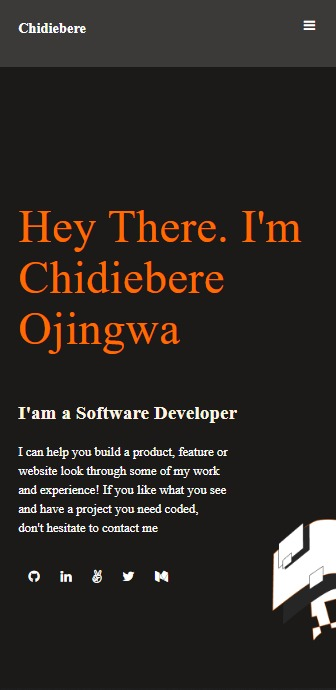

#My Portfolio website

This repository is  my personal portfolio which shows my experiences and previous project. 

## Built With
HTML
CSS
JavaScript
### Setup
clone to you local machine
create a directory on a your local machin.
open your terminal and type: git clone https://github.com/chidiebereojingwa/myportfolio.git
### Usage
Clone project to your local machine 
run the index.html
## Authors

👤 **Author1**

- GitHub: [@githubhandle](https://github.com/chidiebereojingwa)
- Twitter: [@twitterhandle](https://twitter.com/ojingwa)
- LinkedIn: [LinkedIn](https://linkedin.com/in/chidiebereojingwa)

